# WAN (Wide Area Network)

## Что такое глобальные сети и для чего они нужны ?

Локальные сетки могут быть не оч удобными, когда приходится обмениваться данными на большие расстояния (между городами или даже континентами)

Соединения, позволяющие объеденять LAN на большом расстоянии называются **глобальными сетями**

* Глобальным сетям для работы требуются отдельные технологии
* Построением и обслуживанием WAN занимаются провайдеры
* Предоставление доступа к глобальной сети это платная услуга, которая оказывается провайдерами
* Компания может построить WAN, но при условии, что есть много денег
* WAN != internet. internet является WAN, но не всякая WAN это internet
  * Т.е не все WAN строятся на тех же технологиях что и internet

## Типы соединения WAN
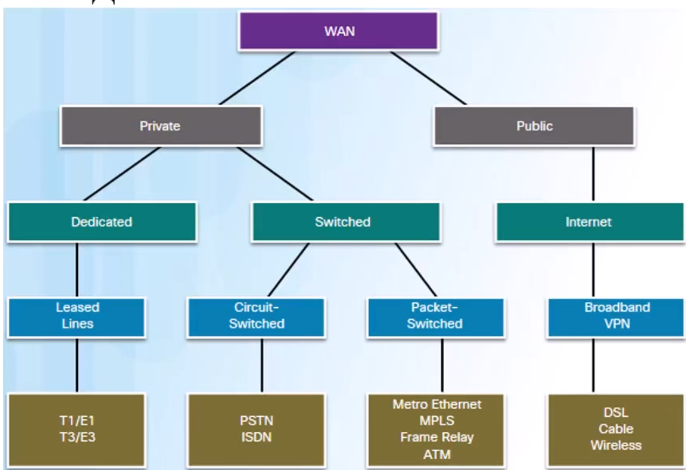

* Глобальные сети делятся на 
  * частные(частный трафик передаётся внутри одной организации), которые делятся на:
    * Выделенные каналы
      * Реализуются с помощью арендованных линий
        * T1/E1, T2/E3
    * Коммутируемые каналы
      * Коммутация каналов
        * PSTN, ISDN
      * Комутация пакетов
        * MPLS, Metro Ethernet
  * публичные
    * Internet
      * технологии широкополосной связи, VPN
      * DSL, Cable, wireless(спутник, 4g связь)

## Топологии WAN

Облачко это какая реализация подключения физических устройств между собой. 

Нас больше интересуют логические топологии

### Point-to-point 
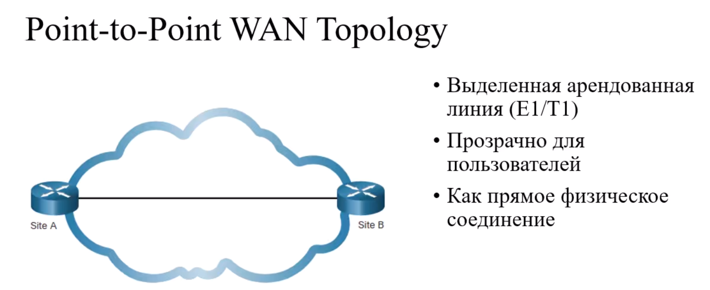
* передача трафика между граничными маршрутизаторами в разных филиалах одной организации

### Hub-and-Spoke (звезда) 

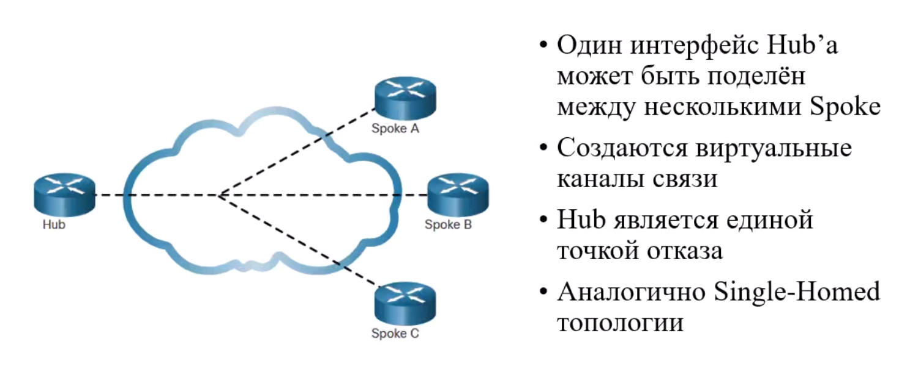

Один главный офис организации и филиалы этой организации связаны с ним

### Dual-homed

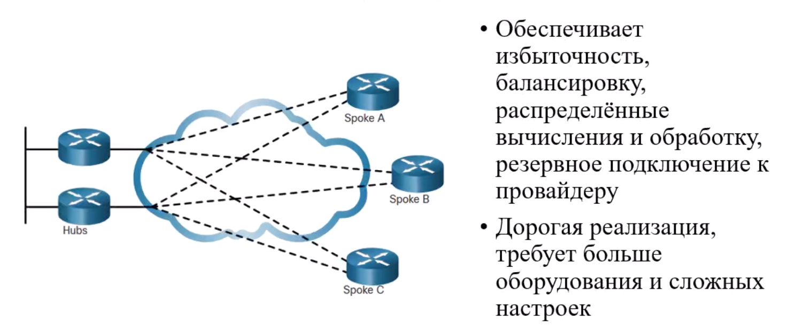

Похожа на прошлую топологию, но присутствует обеспечение отказоустойчивости за счёт избыточности главных роутеров, с которыми связаны другие филиалы. Также дублируются логические каналы связи

также присутствует балансировка нагрузки

### Full Mesh(полносвязна топология)

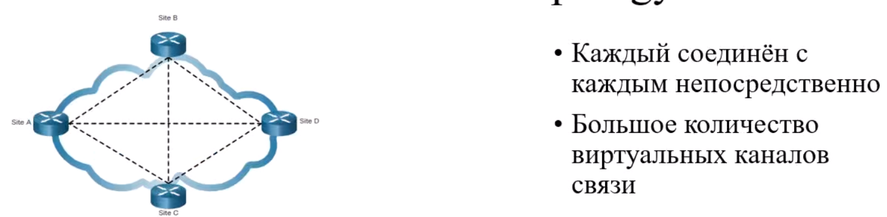

Каждый филиал связан друг с другом

предоставляет отказоустойчивость

### Partial Mesh(частично связная топология)

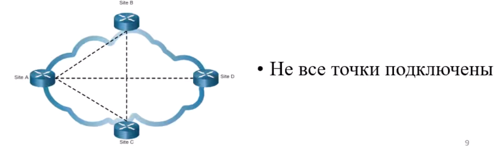

Обеспечение отказоустойчивости между некоторыми логическими узлами

**Выбор топологии зависит от технологий, которые используются для создания сети**

## Варианты физического подключения ISP(interner service provider)

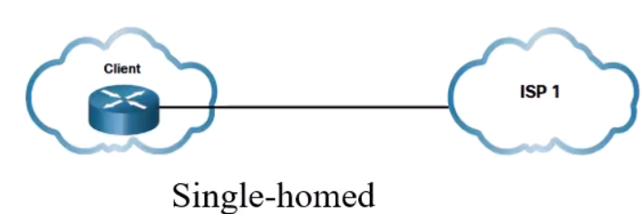
* один клиент - один провайдер
* Стоит недорого, но есть единая точка отказа в лице провайдера, а также канала связи
* Подходит для домашнего подключения либо небольших организаций

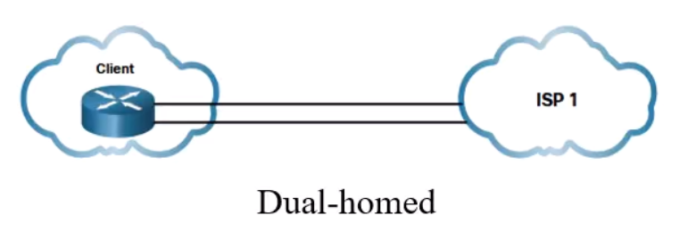
* ecть 2 канала для подключения, что обеспечивает отказоустойчивость
* Остаётся единая точка отказа в лице провайдера
* Подходит для домашнего подключения либо небольших организаций

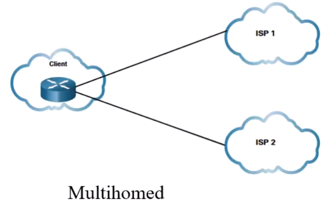
* используются 2 провайдера(основной и провайдера)
* етсь отказоустойчивость в лице нескольких провайдеров

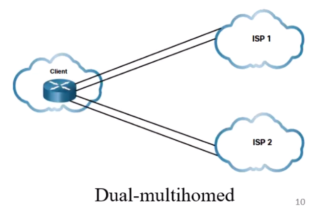
* Максимальная отказоустойчивость за счёт нескольких каналов + нескольких провайдеров
* Подходит для средних и больших организаций

## Принципы работы WAN

## WAN в модели osi

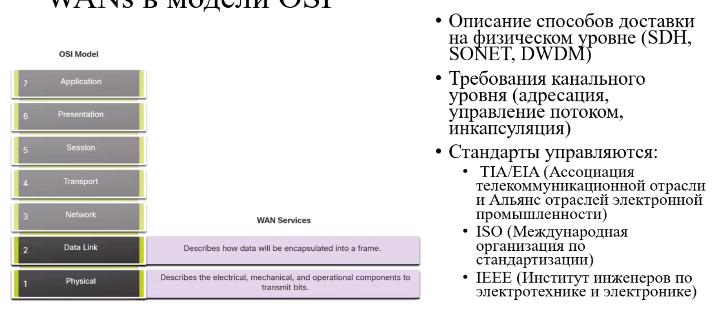

## Терминология в WAN

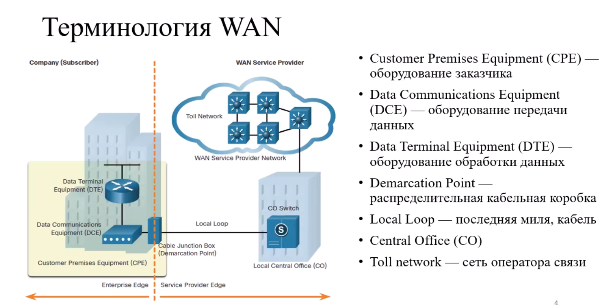

## Устройства для создания WAN

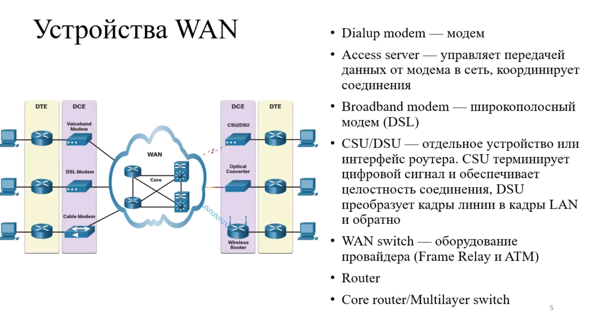

## Типы соездинения

### Последовательная связь

### Параллельная связь
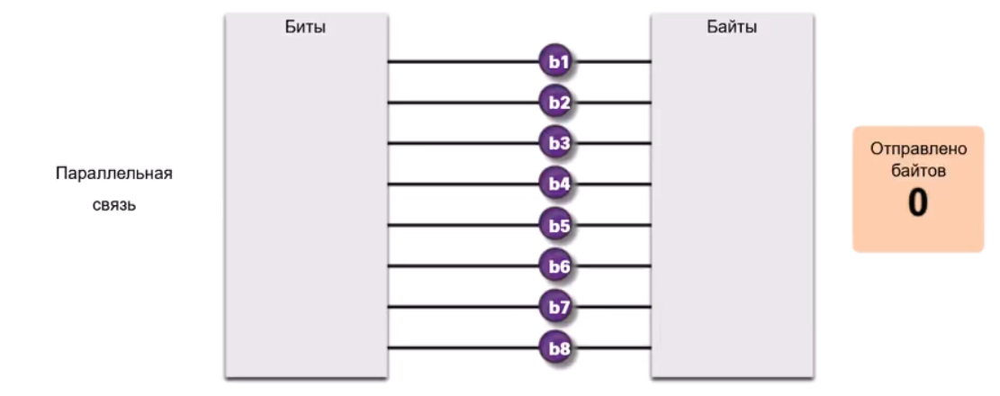
* не работает на больших расстояних, из-за рассинхрона доставки битов, что приводит к ошибкам

## Типы коммутации

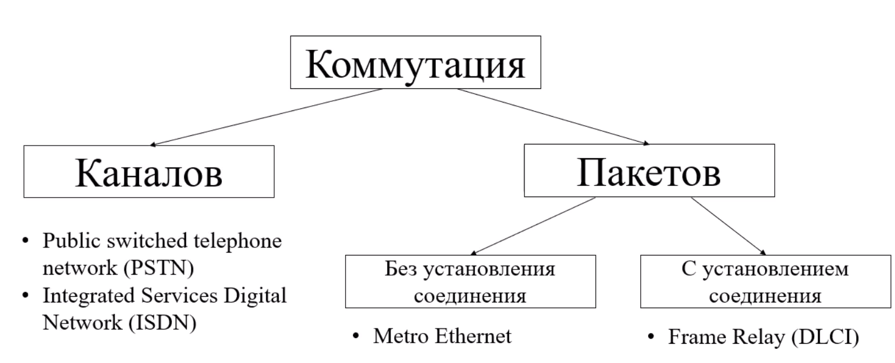

В **сети коммутации каналов** прежде чем пользователи смогут обмениваться данными устанавливается выделенное электрическое соединение(канал связи) между узлами. Для пользователя выделена вся емкость канала, которая ему всегда доступна 

* Высокая пропускная способность за счёт единоличного владения каналов
* Неээфективное использование каналов, чел может владеть каналов, при этом не передавать сообщений
* примерами коммутации каналов 
  * - Public switched telephone network(PSTN)
  * Integrated Services Digital Network (ISDN)

2ой тип - коммутация пакетов - Трафик разделяется на пакеты, которые уже передаются по сети общего пользования, т.е по одному и тому каналу могут передаваться пакеты разных пользаков

* Такой способ более дешевый, т.к одним каналом могут пользоваться несколько человек
* Скорость канала распределяется между всеми пользователями, что может привести к задержкам

Различают коммутацию пакетов
* Без установки соединения
  * Metro Ethernet 
* С установкой соединения
  * MPLS, Frame Relay(DLCI)

## Структура сети провайдера(технологии физического уровня, используемые для построения сети провайдера)

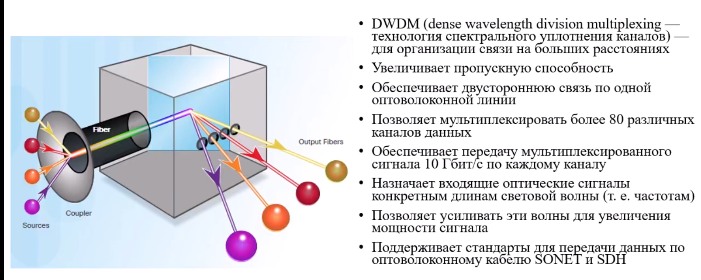

* Оптоволоконный кабель
  * позволяет передавать сигнал на большие расстояния с меньшим затуханием сигнала
  * Станадрты передачи сигналов по оптоволоконному кабелю SDH, SONET
  * DWDM - новая технология, которая является развитием SDH и SONET

## Технологии подключения клиентов к WAN

### Выделенные линии, Арендованные линии

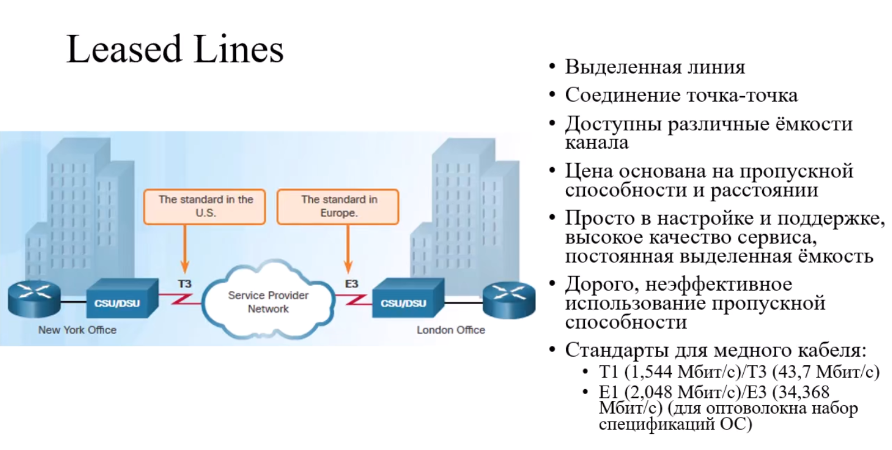

* Технология устаревшая, в РФ никогда такой не было
* T - америкаский стандарт, E - европейский стандарт
* Клиент целиком арендует канал связи. Каналом может пользоваться только клиентом
* Даёт предсказуемую скорость
* Оч дорого

### Коммутация каналов

* Пользователю также выделяется канал, но он может изменяться динамически. На время установки полностью принадлежит клиенту

* PSTN (Устаревшая технология)

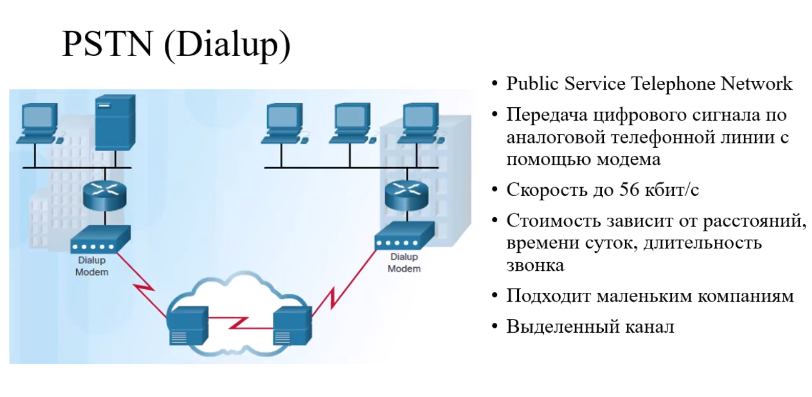

  * Работает на основе телефонных линий

  * Подключиться можно с помощью Dialup модема(преобразователь аналогового и цифрового сигнала)

  * Есть минус, что нельзя одновременно передавать аналоговый и цифровой сигналы, т.е при использовании телефона, интернет вырубается

* ISDN Устаревшия технология
 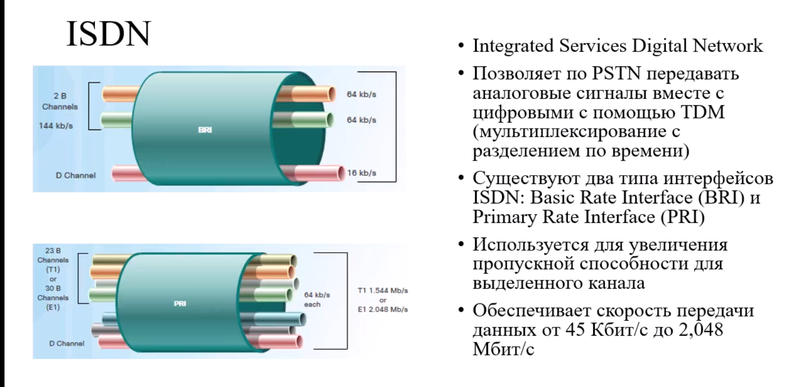
  * Цифровые данные передаются по телефонным линиям
  * Используются разные каналы для передачи разных типов данных
    * D - Используются для управляющей информации
    * B - Используются для передачи данных либо голоса
  

### Коммутация пакетов

**Frame Relay (устаревшая)**
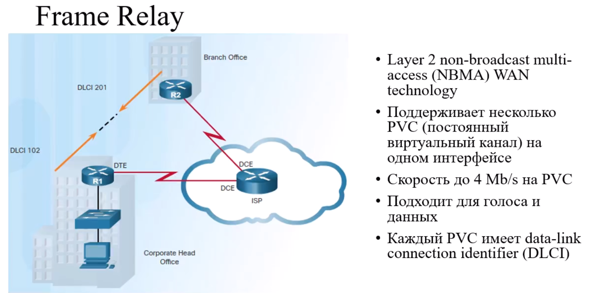

* в пакеты добавляется специальный идентификатор канала, с помощью которого роутер принимает решение, куда отправить пакет

**ATM (Устаревшая)**
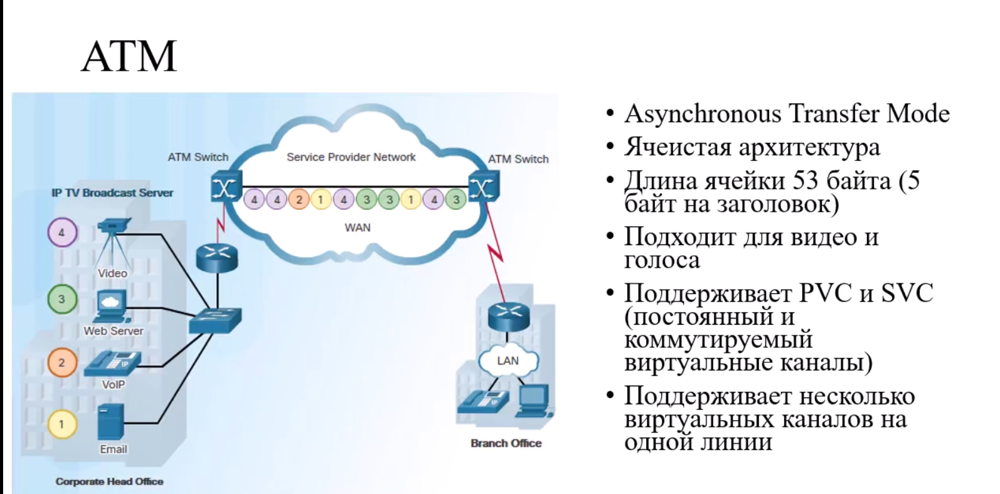

* Работаем с ячейками длины 53 байта(5 в заголовке, остальные данные)
* Небольшой объем сообщений позволяет осуществлять быструю отправку

Если использовать большие сообщения, то сообщения придётся фрагментировать и мы будем тратить большую часть пропускной способности сети не на передачу данных, а на передачу заголовка фрагментации

**Ethernet WAN**

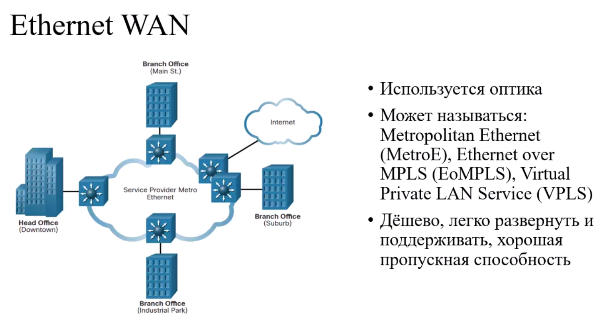

* используется оптика либо каналы с высокой пропускной способностью

**MPLS**

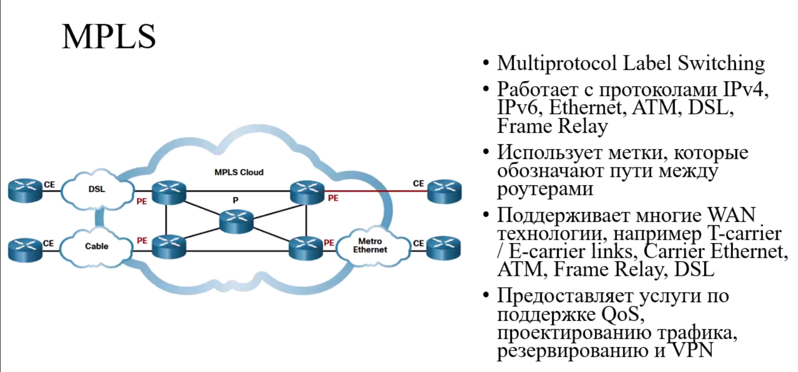

используются метки для установки канала между роутерами(виртуальный канал)

## Технологии для организации общедоступных глобальных сетей

делятся на проводные и беспроводные

Проводные дорого прокладывать, т.к требуются технологии для прокладки кабеля, хороший кабель 

Беспроводная связь позволяет предоставлять интернет в малодоступнх местах(Пустыня, джунгли), меньше стоит. Но качество сигнала оч сильно зависит от окружающих факторов + есть помехи

### DSL

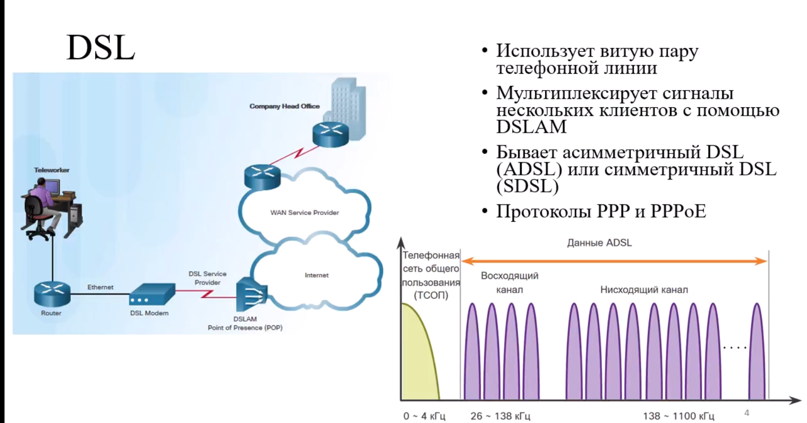

Использует телефонные каналы связи для передачи трафика, но позволяет передавать одновременно цифровой и аналоговый сигналы

При звонке интернет вырубаться не будет

Происходит за счет выделения отдельного диапозона частот для обмена телефоным трафиком и данными

### Кабельная технология

Используется кабель для телевизора для передачи интернет трафика

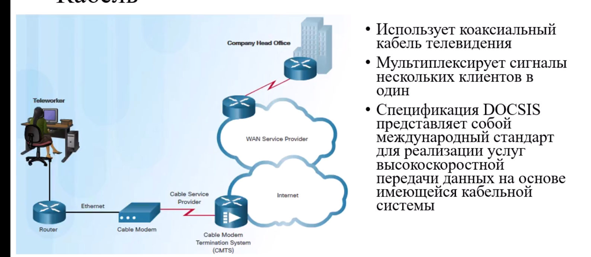

### Спутниковый интернет

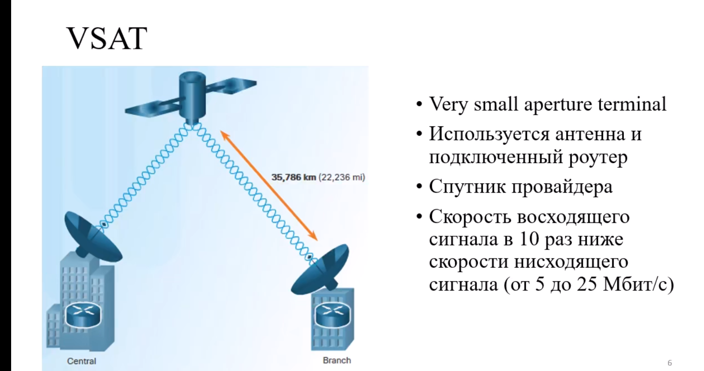

Старлинк

Используются в местах, где инет другими методами провести невозможно

### Городские сети WI-FI

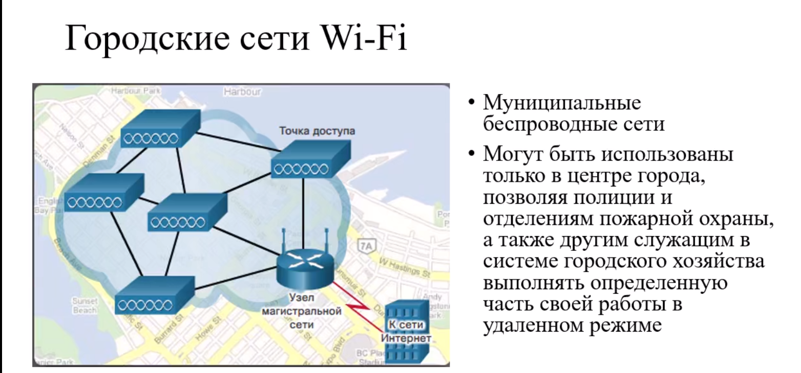

### Широкополосная беспроводная связь WiMax

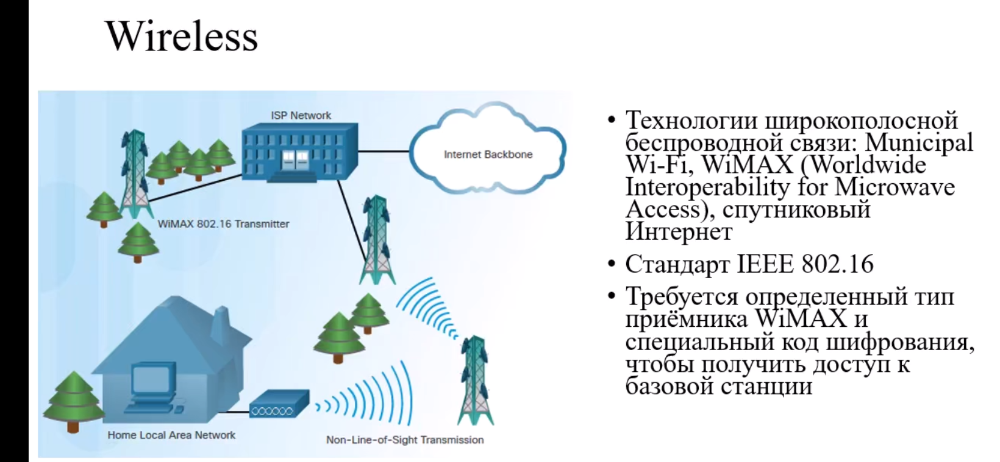

требуются специальные вышки wimax

в рф что-то зараждалось, но потом прекратили развитие, т.к вышки строить дорого

### Сотовая связь / мобильный инет
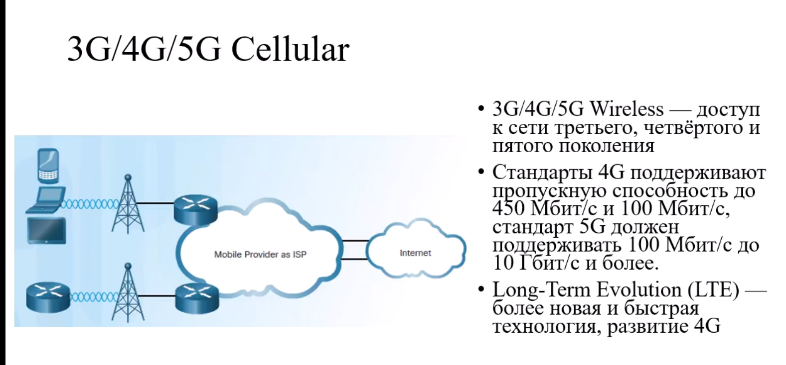

Используются чаще всего, т.к телефонные вышки есть везде

### VPN

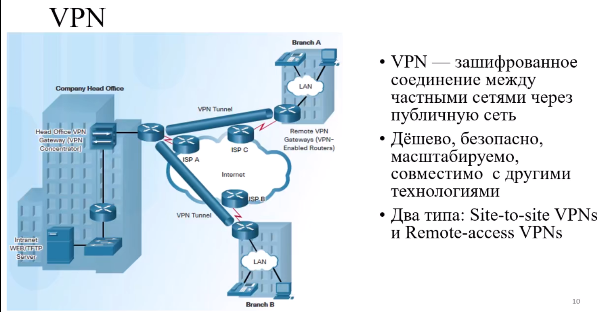

Осталась потребность использовать выделенный канал связи, но технологии которые позволяют это делать устарели + это дорого, поэтому на сцену вышел VPN

VPN - имулирует частную сеть с помощью различных технологий шифрования

+ это дешево, т.к работает поверх обычного глобального инета, т.е при открытии новых филиалов не требуется создавать специальную инфраструктуру

2 типа vpn

* site-to-site VPN
* Remote-access VPN

## Какую технологию использовать для подключения WAN

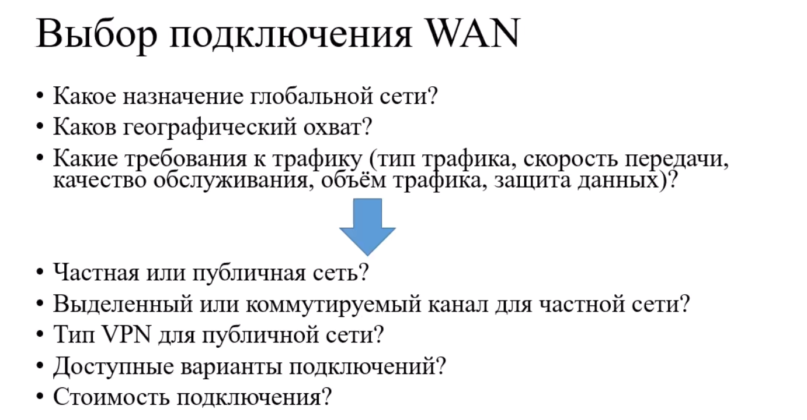

Идеально это оптоволоконный кабель, но это не всегда возможно + не везде нужно

Т.е нужно действовать по потребностям + возможностям

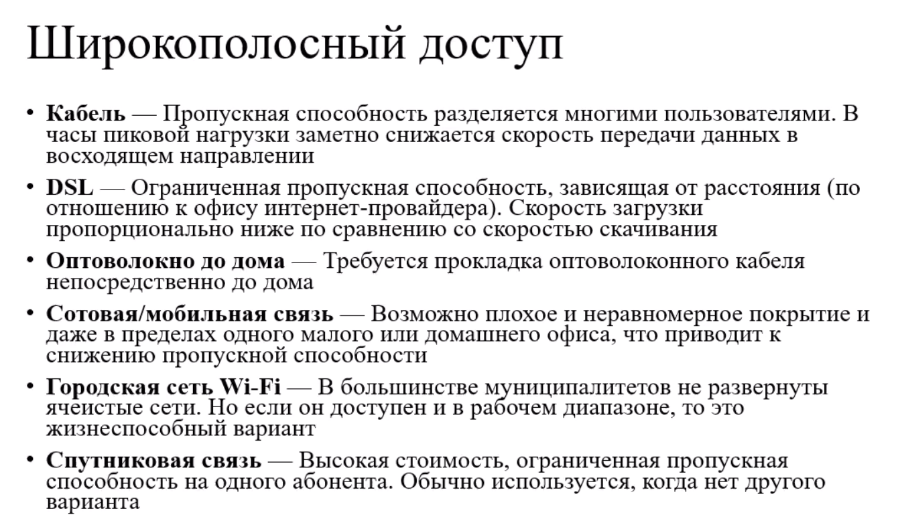

Необходимо оценить затраты и преймущества

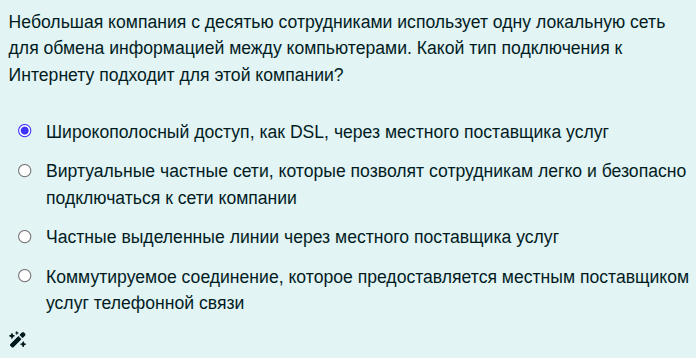
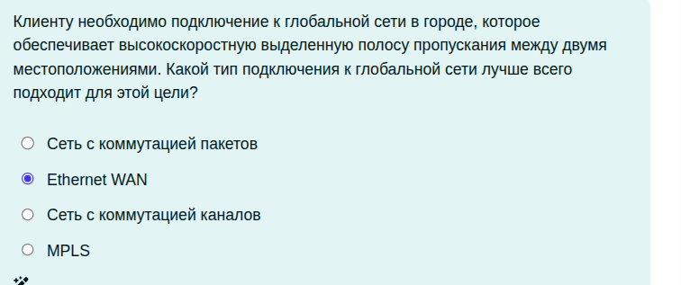

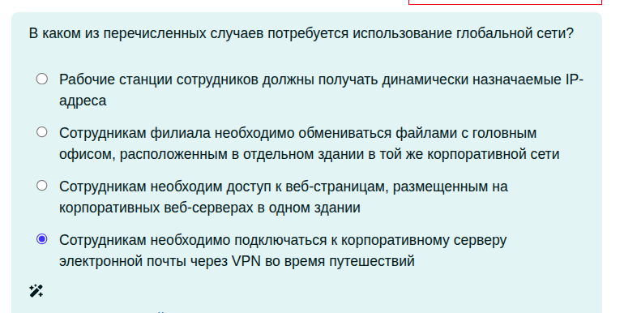
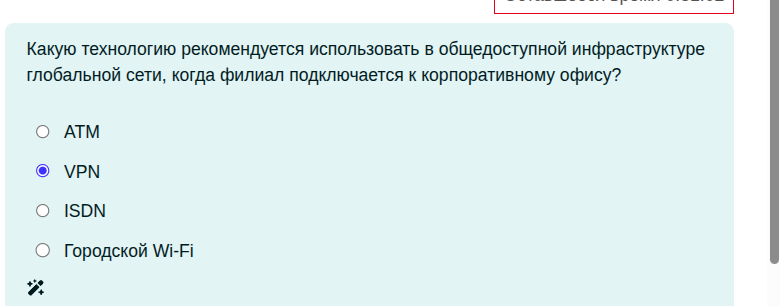

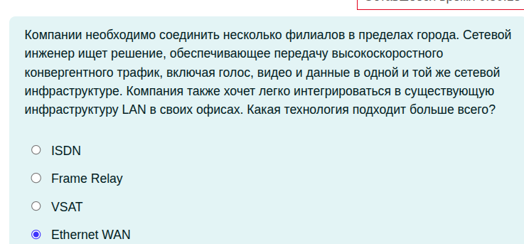

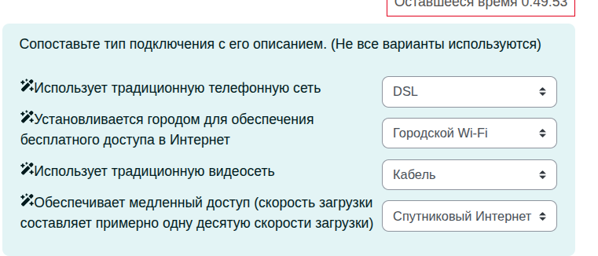

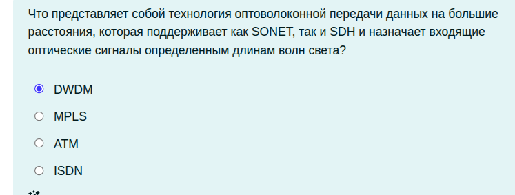
